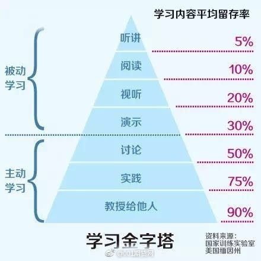

# Plan
*关于项目实践、各类技能提高和知识积累的基本学习计划。欢迎补充。*

---

## Just Practice
*实践才能巩固和提高。*

### Java
*目前针对Spring Boot，过程中了解Spring、SpringMVC*

*学习的方法基本就是网上的教程、看书、视频教学，最初着手最好是跟着网上教程实践，基本了解实践之后再细致看书，书看不下去可以看视频。* :unamused:~~视频太慢了~~

*下面是我建议的项目实践的过程，找了一些教程，不一定就是很好的，也需要自己去找，包括具体编程问题需要自学解决。互联网是最大的资源，我相信只要想找并且方法对，没有找不到的信息。*

+ 了解基本概念。[Spring Boot学习](http://www.cnblogs.com/larryzeal/p/5765945.html)
+ 搭建环境，hello world。[Spring Boot 官方文档学习（一）入门及使用](http://www.cnblogs.com/larryzeal/p/5799195.html#c4-5)*工具或什么别的，尽量先看官方文档。*
+ 了解项目文件结构。
+ 了解MVC思想。[mvc设计模式和mvc框架的区别](http://www.cnblogs.com/understander/p/5552207.html)
+ 简单RESTfull API接口实现。[Spring Boot基础教程2-RESTfull API简单项目的快速搭建](http://www.roncoo.com/article/detail/124977)
+ 面向对象设计思想。

+ 实现文件读写。
+ 了解关系型数据库，实现MySQL数据库增删改查。[图形化数据库建模工具MySQL WorkBench教程](doc/WorkBench.pdf)
+ 实现http/https请求调用。
+ 项目部署。[Linux下Tomcat的安装配置](http://blog.csdn.net/zhuying_linux/article/details/6583096)
+ 了解系统设计。[架构蓝图--软件架构 "4+1" 视图模型](https://www.ibm.com/developerworks/cn/rational/r-4p1-view/)
+ **编程规范！**[Java编码规范](doc/Java programming - penghy.docx)

### Git
*了解版本控制的意义和Git的原理。*
+ [浅显易懂的Git教程](http://www.liaoxuefeng.com/wiki/0013739516305929606dd18361248578c67b8067c8c017b000)

### Shell
*服务器搭建和项目部署避不开Shell命令，熟悉基本的工具和操作命令。*
+ ssh登录服务器。[Xmanager](http://www.netsarang.com/products/xme_overview.html)
+ 常用命令速查。[Linux常用命令大全](http://www.php100.com/html/webkaifa/Linux/2009/1106/3485.html)
+ [Cygwin](https://www.cygwin.com/) *a large collection of GNU and Open Source tools which provide functionality similar to a Linux distribution on Windows. (Windows命令映射成Linux命令。)*
+ 有余力的同学:joy:可以折腾一下Ubantu图形化界面。

### Python
*数据学（Dataology）和数据科学（Data Science）*
+ [Python入门教程](http://www.liaoxuefeng.com/wiki/001374738125095c955c1e6d8bb493182103fac9270762a000)
+ [加入Kaggle大数据竞赛，总共分几步？](http://www.leiphone.com/news/201703/V2laCNgYqI9Gs6ul.html)

---

## Efficiency is LIFE
*善于利用更好、更顺手的工具高效率地解决问题就是能力的提升。*

### Editor
*文本编辑器，提高文本处理效率。*
+ 推荐Sublime，基本满足所有需求。[Sublime Text 3 调教你的私人利器（上）](http://www.sheyilin.com/2015/05/sublime_text_3_tiao_jiao_ni_de_si_ren_li_qi_1/)
+ [Sublime Text 有哪些使用技巧？ - 28 个回答, 5551 人关注](https://www.zhihu.com/question/24896283)

### Markdown
*简单的标记语言，利于文档展示。*
+ Markdown编辑器很多，Sublime加插件就可以，还有一些在线的。[马克飞象](https://maxiang.io/)
+ [Markdown，你只需要掌握这几个](http://www.cnblogs.com/crazyant007/p/4220066.html)

### LaTeX
*功能强大的排版系统。*

### IDE
*用更好的IDE，提高Coding效率。*
+ [都说 IntelliJ 比 Eclipse 好用，那么 IntelliJ 有哪些好用的技巧？ - 回答作者: 季文昊](http://zhihu.com/question/29076145/answer/43874375)

### Bibliography reference manager
*paper文献管理。*
+ [JabRef](http://www.jabref.org/)
+ [JabRef中文手册](http://blog.csdn.net/zd0303/article/details/7676807)*使用教程。*
+ [利用Bibtex4Word实现Word写作时参考文献的插入和排版](http://blog.lehu.shu.edu.cn/shuishousong/A269375.html)

---

## Change the World
*学习的过程能够帮助你决定工作的方向，当你看到其它人改变世界的先例，你也会知晓自己应该如何改变世界。-- Andrew Ng*

### Framework
*结构生长，形成扎实的支撑。*
+ 了解你的工作内容。[一张图看懂数据科学家、数据工程师和软件工程师之间的区别](http://www.leiphone.com/news/201703/u6UW2CFBbGa4bRrN.html)
+ 了解研究的领域，看综述性质的文献。以chatbots举例：[巨头们都很重视的聊天机器人，你不进来看看吗？](http://mp.weixin.qq.com/s?__biz=MzA4OTk5OTQzMg==&mid=2449231265&idx=1&sn=249d8513aab9f8ce3ee137a19cea8099#rd)

### Rationale
*视野的纳新和扩展，开枝散叶。*
+ 看研究具体问题的blog或paper。

### Insights
*洞察，提炼自己的思想。*
+ 提炼笔记，每周总结看到的文章，加上本周的工作内容，给指导老师一个周报。[参考](doc/notes - lirang - 20161028.pdf)
+ 知识分享，自发组织不定期学术交流，讲清楚一篇文章或一个具体问题，展现方式尽量生动，可以请老师参加。学习内容留存率：讲授 > 实践 > 讨论 > 演示 > 视听 > 阅读 > 听讲

---
*Copyright © 2017 lirang. All Rights Reserved.*
